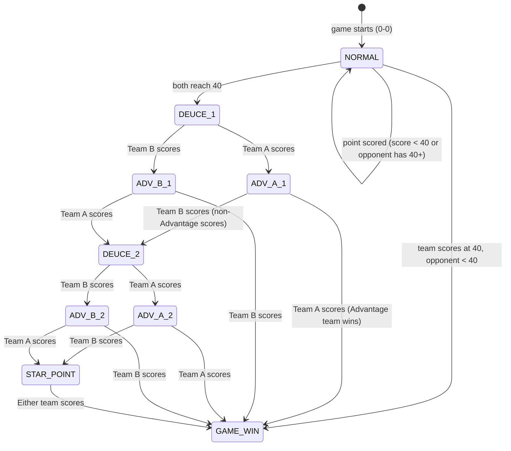

# Design Document

## Overview

The Padel Scoring System is a fully client-side web application that tracks a best-of-three Padel match according to FIP official rules, including the 2026 amendment (maximum two deuces per game, followed by a Star Point). It is implemented as a single HTML file using HTML5, Tailwind CSS (via CDN), and Vanilla JavaScript — no build tooling, no frameworks, no back-end.

The application moves through three screens: a **Setup Screen** (player names + initial server selection), a **Match Screen** (scoreboard + scoring controls), and a **Result Screen** (match winner display + new match button). All state lives in a single JavaScript object, and the DOM is updated imperatively after every state mutation. An undo stack of depth one enables score correction.

### Key Design Decisions

- **Single-file delivery**: Everything ships in one `index.html`, making it trivially hostable (GitHub Pages, any static host, or simply opened from disk).
- **State-first architecture**: A plain JavaScript `MatchState` object is the single source of truth. All scoring logic operates on the state object, and a separate `render()` function projects state onto the DOM. This clear separation makes the scoring rules easy to test in isolation.
- **Immutable snapshots for undo**: Before each state mutation the current state is deep-cloned and stored as `previousState`. A single undo restores this snapshot.
- **Tailwind via CDN**: No build step required; the CDN script handles class scanning at runtime.

---

## Architecture

The application is structured around a **unidirectional data flow**:

```
User Action (button click)
        │
        ▼
  scorePoint(team) / undoLastPoint()
        │
        ▼
  Mutate MatchState  ◄── clone into previousState first
        │
        ▼
     render()
        │
        ▼
  DOM updated
```

### Module Breakdown (all within a single `<script>` block)

| Module / Concern | Responsibility |
|---|---|
| `MatchState` object | Single source of truth for all match data |
| Scoring engine functions | Pure-ish functions that mutate `MatchState` following FIP rules |
| `render()` | Maps `MatchState` → DOM; called after every state change |
| Event listeners | Thin wrappers that call scoring engine then `render()` |
| Validation helpers | Form input validation (name length, non-whitespace) |

---

## Components and Interfaces

### Screen: Setup

- Four `<input type="text">` fields: Player A1, Player A2, Player B1, Player B2
- A "Start Match" `<button>` that triggers form validation
- Inline `<span>` error elements per input, shown/hidden via Tailwind's `hidden` class
- A server-selection radio group (Team A / Team B), shown after valid names are confirmed

### Screen: Match

- **Scoreboard panel**: Team names, set score columns (up to 3 sets), current game score, current point score, game mode badge, serving indicator
- **Score buttons**: One large button per team (Team A / Team B)
- **Undo button**: Single undo action; disabled when no previous state exists

### Screen: Result

- Winner announcement with team names
- Final set scores for each completed set
- "New Match" button that resets state and returns to Setup

### Internal Interfaces

#### `MatchState` object

```js
{
  // Setup
  players: { a1: string, a2: string, b1: string, b2: string },

  // Set-level
  sets: [
    { scoreA: number, scoreB: number }  // one entry per completed set
  ],
  currentSet: number,          // 0-indexed, 0 or 1 (or 2 for super tiebreak)

  // Game-level (within current set)
  gamesA: number,
  gamesB: number,

  // Point-level (within current game)
  pointsA: number,             // 0-4 (0=0, 1=15, 2=30, 3=40, 4=deuce context)
  pointsB: number,

  // Game state machine
  gameMode: 'NORMAL' | 'TIEBREAK' | 'SUPER_TIEBREAK',
  deuceCount: number,          // 0, 1, or 2 — tracks first/second deuce
  gamePhase: 'NORMAL' | 'DEUCE_1' | 'ADV_A_1' | 'ADV_B_1'
             | 'DEUCE_2' | 'ADV_A_2' | 'ADV_B_2' | 'STAR_POINT',

  // Service
  servingTeam: 'A' | 'B',
  initialServer: 'A' | 'B',   // server at start of current set
  tiebreakPointsPlayed: number, // for tiebreak service rotation

  // Undo
  previousState: MatchState | null,

  // Match completion
  matchOver: boolean,
  winner: 'A' | 'B' | null,
  setsA: number,               // sets won by team A
  setsB: number,               // sets won by team B
}
```

#### Scoring Engine Functions

```js
function scorePoint(team: 'A' | 'B'): void
function undoLastPoint(): void
function initMatch(players, servingTeam): void
function resetToSetup(): void
```

#### Helper / Utility Functions

```js
function validateNames(formData): ValidationResult
function cloneState(state): MatchState        // deep clone for undo
function getPointLabel(points, phase, team): string
function getGameModeLabel(mode): string
function checkSetWin(): boolean
function checkMatchWin(): boolean
function rotateTiebreakService(): void
```

---

## Data Models

### Game Phase State Machine

The game phase follows a strict finite state machine. The diagram below shows all valid transitions:



### Point Score Representation

| Internal `pointsX` value | FIP Label (Normal game) | Tiebreak / Super Tiebreak |
|---|---|---|
| 0 | "0" | "0" |
| 1 | "15" | "1" |
| 2 | "30" | "2" |
| 3 | "40" | "3" |
| Phase = DEUCE_x | "Deuce" | n/a (no deuce in TB) |
| Phase = ADV_A/ADV_B | "Adv" + indicator | n/a |
| Phase = STAR_POINT | "★ Star Point" | n/a |

For Tiebreak and Super Tiebreak, `pointsA` and `pointsB` are raw integers incremented directly (no 15/30/40 mapping).

### Service Rotation Rules

| Situation | Rule |
|---|---|
| End of normal game | Serve transfers to opponent |
| Start of new set | Serve goes to team that received in last game of previous set |
| Tiebreak / Super Tiebreak start | Same team that would serve the next game serves first |
| Tiebreak first point | Serve changes after point 1 |
| Tiebreak subsequent | Serve changes every 2 points (points 3, 5, 7, …) |

Service rotation in tiebreak is determined by `tiebreakPointsPlayed`:
- `tiebreakPointsPlayed === 1`: rotate
- `(tiebreakPointsPlayed - 1) % 2 === 0 && tiebreakPointsPlayed > 1`: rotate

### Set Win Conditions

| Condition | Winner |
|---|---|
| Games = 6, opponent ≤ 4 | Team with 6 games |
| Games = 7, opponent = 5 | Team with 7 games |
| Games = 7, opponent = 6 (via tiebreak) | Tiebreak winner; set recorded as 7–6 |

### Match Flow

```
Setup Screen
     │
     ▼
Set 1 (Normal games → possible Tiebreak at 6-6)
     │ one team wins set
     ▼
Set 2 (Normal games → possible Tiebreak at 6-6)
     ├─ one team wins both sets → Match Over
     └─ each team wins one set
                │
                ▼
         Super Tiebreak (first to 10, win by 2)
                │ winner determined
                ▼
           Match Over
```

---

## Correctness Properties

*A property is a characteristic or behavior that should hold true across all valid executions of a system — essentially, a formal statement about what the system should do. Properties serve as the bridge between human-readable specifications and machine-verifiable correctness guarantees.*

### Property 1: Whitespace names are always rejected

*For any* combination of four player name strings where at least one string consists entirely of whitespace characters (spaces, tabs, newlines), the form validation function SHALL return invalid and the match SHALL NOT start.

**Validates: Requirements 1.3, 1.4**

---

### Property 2: Team names are displayed in "Player1 / Player2" format

*For any* pair of valid player name strings submitted as a team, the scoreboard SHALL display exactly the string `"<name1> / <name2>"` for that team.

**Validates: Requirements 1.5**

---

### Property 3: Player name length is capped at 30 characters

*For any* input string of length greater than 30, the name stored and displayed SHALL be at most 30 characters long (either rejected or truncated at the input level).

**Validates: Requirements 1.6**

---

### Property 4: Initial server is always reflected in match state

*For any* choice of initial serving team (A or B) made on the setup screen, the `servingTeam` field in `MatchState` after `initMatch()` SHALL equal that chosen team, and the scoreboard serving indicator SHALL reflect that team.

**Validates: Requirements 2.2, 2.3**

---

### Property 5: Normal game point progression follows FIP sequence

*For any* game state where a team's point score is below 40 (internal values 0, 1, or 2) and the game phase is NORMAL, scoring a point for that team SHALL advance their score by exactly one step in the sequence 0 → 15 → 30 → 40.

**Validates: Requirements 3.2**

---

### Property 6: Game phase state machine is always valid

*For any* sequence of point-scoring actions on a normal game starting from 0-0, the `gamePhase` field SHALL always be one of the defined states (`NORMAL`, `DEUCE_1`, `ADV_A_1`, `ADV_B_1`, `DEUCE_2`, `ADV_A_2`, `ADV_B_2`, `STAR_POINT`, `GAME_WIN`), and SHALL follow only the transitions defined in the FSM. In particular, `deuceCount` SHALL never exceed 2 in any game.

**Validates: Requirements 3.4, 3.5, 3.6, 3.7, 3.8, 3.9, 3.10, 3.11, 3.12, 3.13, 3.14**

---

### Property 7: Game win always resets points and increments game score

*For any* match state, when a game is won (any valid win path through the FSM), `pointsA` and `pointsB` SHALL both be reset to 0 and the winning team's `gamesX` SHALL increase by exactly 1.

**Validates: Requirements 3.3, 3.6, 4.1**

---

### Property 8: Set win conditions are correctly enforced

*For any* game score state `(gamesA, gamesB)`, awarding a game SHALL trigger a set win if and only if the resulting game score satisfies one of these conditions:
- One team has ≥ 6 games AND leads by ≥ 2 games (standard win)
- One team has 7 games and the other has 5 (7–5 win)
- A tiebreak was won (set recorded as 7–6)

After a set win, `gamesA` and `gamesB` SHALL both reset to 0 and `setsA` or `setsB` SHALL increment by exactly 1.

**Validates: Requirements 4.2, 4.3, 4.6**

---

### Property 9: Tiebreak activates at exactly 6-6

*For any* set where both teams' game scores reach 6 (and neither won the set before that), `gameMode` SHALL transition to `TIEBREAK` and point scoring SHALL use raw integer counts rather than 15/30/40 labels.

**Validates: Requirements 4.4, 5.1**

---

### Property 10: Tiebreak win requires correct lead

*For any* tiebreak state, the tiebreak SHALL be awarded if and only if the leading team's point count is ≥ 7 AND they lead by ≥ 2 points. No tiebreak win SHALL occur with a lead of exactly 1 point when both teams have ≥ 6 points.

**Validates: Requirements 5.2, 5.3, 5.4**

---

### Property 11: Tiebreak service rotation is correct

*For any* sequence of tiebreak points, the serving team SHALL change after the 1st total point and then after every 2nd subsequent point. Specifically: after point 1, after point 3, after point 5, etc. (i.e., when `tiebreakPointsPlayed` is 1, or when `(tiebreakPointsPlayed - 1) % 2 === 0` and `tiebreakPointsPlayed > 1`).

**Validates: Requirements 5.5, 6.6**

---

### Property 12: Super Tiebreak activates at 1-1 in sets

*For any* match state where each team has won exactly one set, `gameMode` SHALL transition to `SUPER_TIEBREAK` rather than starting a normal third set.

**Validates: Requirements 6.1**

---

### Property 13: Super Tiebreak win requires correct lead

*For any* super tiebreak state, the match SHALL be awarded if and only if the leading team's point count is ≥ 10 AND they lead by ≥ 2 points. No win SHALL occur when both teams have ≥ 9 points and the lead is exactly 1.

**Validates: Requirements 6.3, 6.4, 6.5**

---

### Property 14: Service alternates after every normal game

*For any* sequence of completed normal games within a set, the serving team SHALL strictly alternate after each game (A → B → A → B, etc., from the first server of that set).

**Validates: Requirements 7.1**

---

### Property 15: Set service continuation rule is respected

*For any* transition from one set to the next, the team that serves first in the new set SHALL be the team that received serve in the last game of the previous set (i.e., the same team that would have served next if the previous set had continued).

**Validates: Requirements 7.2**

---

### Property 16: Match ends exactly when Set_Score reaches 2

*For any* match state, `matchOver` SHALL become `true` if and only if `setsA === 2` or `setsB === 2`. After match completion, no further state mutations SHALL occur in response to score button presses.

**Validates: Requirements 8.1, 8.3**

---

### Property 17: Undo restores the complete prior state

*For any* match state after at least one point has been scored, pressing Undo SHALL produce a state that is deeply equal to the state captured in `previousState` immediately before that last point was scored. No field of `MatchState` shall differ between the restored state and the snapshot.

**Validates: Requirements 9.1, 9.2**

---

### Property 18: Scoreboard always renders all required fields

*For any* match state (Normal game, Tiebreak, Super Tiebreak, or Match Over), the rendered DOM SHALL contain: team names in "P1 / P2" format, the current set score, the current game score, the current point score (using correct labels for the active mode), and the game mode badge.

**Validates: Requirements 10.1, 10.3**

---

## Error Handling

### Input Validation Errors

| Error Condition | Behavior |
|---|---|
| Empty or whitespace-only name field | Show inline error message under the field; prevent form submission |
| Name exceeds 30 characters | Input attribute `maxlength="30"` prevents entry beyond 30 chars |
| No server selected | Show validation error; prevent form submission |

Validation runs on form submit. Each invalid field gets a visible error `<span>` (using Tailwind `text-red-500 text-sm`). Valid submission hides all errors and transitions to the match screen.

### Scoring Button Guard

Once `matchOver === true` the score buttons have the `disabled` attribute set, preventing any further state mutations from accidental clicks.

### Undo Guard

The Undo button has the `disabled` attribute when `previousState === null` (initial state, or immediately after an undo, since only one level is stored).

### State Corruption Prevention

All state transitions go through the scoring engine functions, which always validate the current `gamePhase` before applying a transition. An unexpected phase value is a programming error; the engine logs a `console.error` and does nothing, leaving the state unchanged.

---

## Testing Strategy

### PBT Applicability Assessment

This feature is well-suited for property-based testing. The core of the application is a **pure scoring engine** — a collection of functions that take a `MatchState` and produce a new `MatchState` with no side effects (DOM manipulation is separate). The input space (point sequences, player names, server choices) is large, and there are clear universal invariants that must hold across all inputs.

The testing library chosen is **[fast-check](https://fast-check.dev/)** (JavaScript), used in a Node.js test runner (e.g., Vitest or Jest). Since the scoring engine is pure JS with no DOM dependencies, it can be extracted and tested without a browser.

### Unit Tests (Example-Based)

Specific scenarios that demonstrate correct behavior at integration points:

- Setup screen renders four input fields grouped by team
- Submitting the form with valid names transitions to server-selection UI
- Completing setup transitions to the match screen with correct team labels
- Tiebreak set score is recorded as 7–6
- Match result screen shows correct winner name and set scores after match completion
- "New Match" button returns to setup with blank state
- Score buttons are disabled after match completion
- Undo button is disabled at match start
- Single undo restores the previous state (one specific example)
- Game mode badge shows "Tiebreak" during a tiebreak
- Game mode badge shows "Super Tiebreak" during super tiebreak

### Property-Based Tests

Each property test runs with a minimum of **100 iterations** and is tagged with the property number it validates.

**Tag format**: `// Feature: padel-scoring-system, Property <N>: <short description>`

| Property | Test Description | Arbitraries |
|---|---|---|
| P1 | Whitespace names rejected | `fc.stringOf(fc.constantFrom(' ','\t','\n'), {minLength:0})` for one or more name slots |
| P2 | Team name display format | `fc.string({minLength:1, maxLength:30})` × 2 |
| P3 | Name length capped at 30 | `fc.string({minLength:31, maxLength:200})` |
| P4 | Initial server reflected in state | `fc.constantFrom('A','B')` |
| P5 | FIP point sequence | Generate game state with `pointsX ∈ {0,1,2}` in NORMAL phase |
| P6 | FSM phase is always valid | `fc.array(fc.constantFrom('A','B'))` — random point sequences |
| P7 | Game win resets points & increments games | Replay point sequence to game win, assert reset |
| P8 | Set win conditions | Generate `(gamesA, gamesB)` pairs, apply game win, check set logic |
| P9 | Tiebreak activates at 6-6 | Bring set to 6-6 via scored games, assert mode change |
| P10 | Tiebreak win requires 2-point lead | Generate tiebreak point sequences, assert win conditions |
| P11 | Tiebreak service rotation | `fc.array(fc.constantFrom('A','B'))` in tiebreak context |
| P12 | Super Tiebreak at 1-1 | Bring match to 1-1 via set wins, assert mode |
| P13 | Super Tiebreak win requires 2-point lead | Generate super tiebreak point sequences |
| P14 | Service alternates each game | Generate sequence of game wins, track serving team |
| P15 | Set service continuation | Simulate set completion, verify new server |
| P16 | Match ends at Set_Score 2 | Generate match point sequences up to 2-0 or 2-1 |
| P17 | Undo round-trip | Snapshot state → score point → undo → assert deep equality |
| P18 | Scoreboard renders all required fields | Generate any match state, call render, check DOM |

### Test Architecture

The scoring engine (all functions that operate on `MatchState`) SHALL be written as a self-contained module with no DOM imports, enabling direct Node.js testing. The `render()` function is tested separately using a jsdom environment for the unit tests that need DOM assertions.

```
index.html
  └── <script src="scoring-engine.js">  ← pure state functions (testable)
  └── <script src="app.js">             ← render() + event listeners (DOM-dependent)
```

Alternatively, if the single-file constraint is hard, the test setup can use inline `<script>` module exports and a test build step that extracts the engine module. The preferred approach for zero-build delivery is to keep `index.html` as the deliverable and maintain a parallel `scoring-engine.js` that is imported both by `index.html` and by the test suite.
